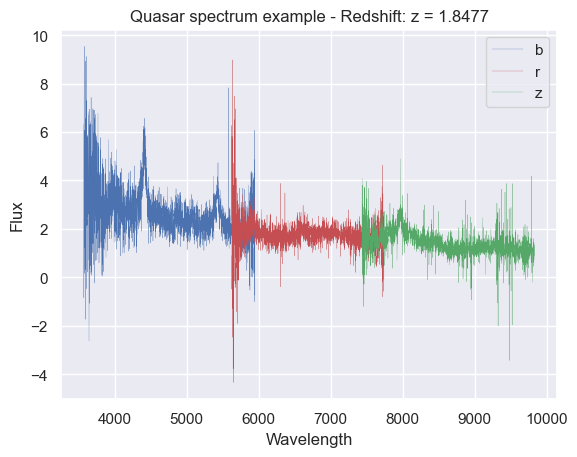
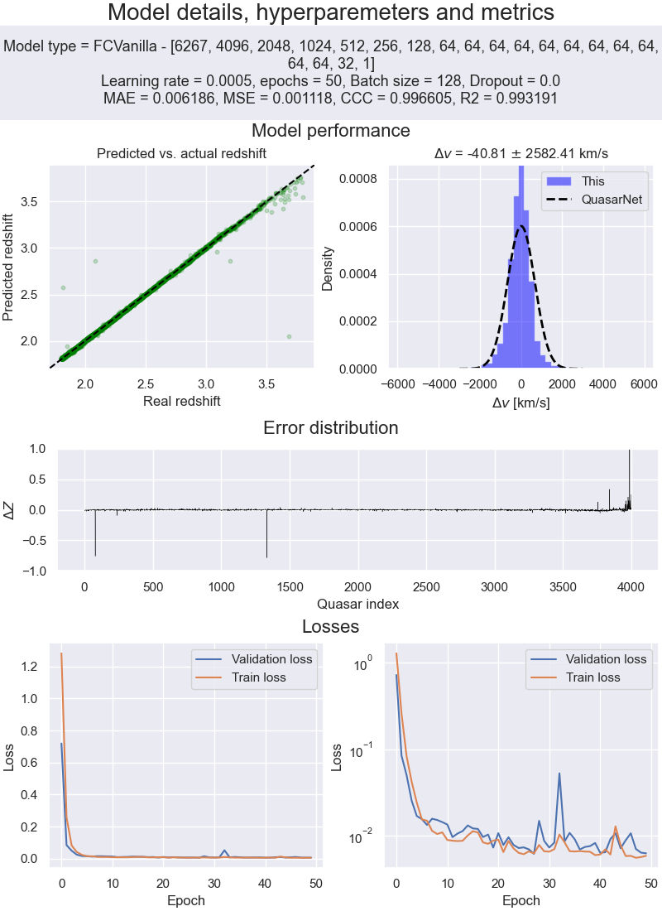

# Deep Learning final project:  DeepRedshift 🤖

*By: Gabriel Missael Barco*

*Professor: Dra. Alma Xochitl González Morales*

The objective of this project is, given the light from a quasar, to predict its redshift. The redshift measures the distance to the quasar, an essential parameter in cosmology.

The data is taken from a simulation provided by the professor and it's composed of 40,000 quasars. An example of the data is shown below:

<center>

</center>

To assess this problem, we tried two different approaches:
1. Fully connected neural network.
2. Convolutional neural network.

For each of those approaches, we tried different architectures and hyperparameters. We obtained the best results with (surprisingly) a fully connected neural network. The summary of the best result is shown below:

<center>

</center>

To compare this result, we compare this best run with the results obtained by [Niculas Busca, Christophe Ballan, 2018, _QuasarNET: Human-level spectral classification and redshifting with Deep Neural Networks_ ](https://arxiv.org/abs/1808.09955). Notably, we compare the distribution of the implied velocity difference between the predicted and the real redshift. In summary, this model is **five times worse than QuasarNET in predicting the redshift**.

QuasarNET obtains a $\Delta v = (8 \pm 664)km/s$, and this project $\Delta v = (-40 \pm 2582)km/s$. The difference is huge, but it's important to remember that this model was trained with only 40k examples, while QuasarNET was trained with about half a million examples.

## Weights & biases magic ✨

We tracked all of the experiments with [Weights and Biases](https://www.wandb.com/). This tool is handy for keeping track of the experiments. The link to the project is [here](https://wandb.ai/gmissaelbarco/QuasarNN?workspace=user-gmissaelbarco). You can see the experiments' results, the code, and the hyperparameters used.

## How to run the code 🏃‍♂️

To run the code, you need to have [Python 3.9](https://www.python.org/downloads/) and [conda](https://docs.conda.io/en/latest/miniconda.html) installed. Then, you need to create a new environment with the dependencies:

```bash
conda create -n quasar python=3.8
conda activate quasar
conda install --file requirements.txt
```

Then, you can start running the main notebook, and that's it! 🎉. There are two notebooks, one with all the project details, `report.ipynb` and code explained, and the other one with the code only, `proyecto_final.ipynb`. Part of the code used in the `proyecto_final.ipynb` notebook is in the `DeepRedshift` folder.

Finally, if you prefer to read the report, refer to the `final_report.pdf` file. Thanks for reading! 🙏

## References 📚

- [Niculas Busca, Christophe Ballan, 2018, _QuasarNET: Human-level spectral classification and redshifting with Deep Neural Networks_ ](https://arxiv.org/abs/1808.09955)
